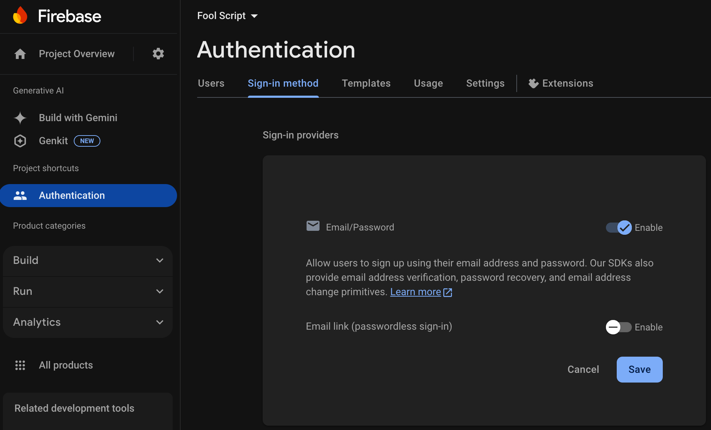
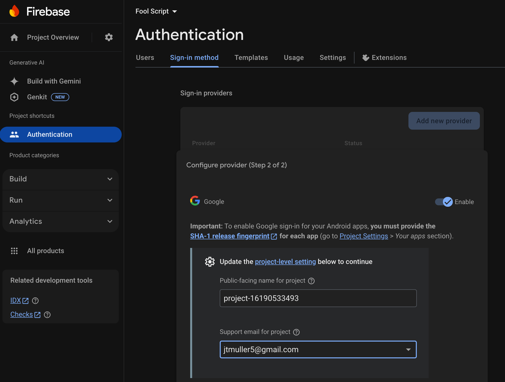
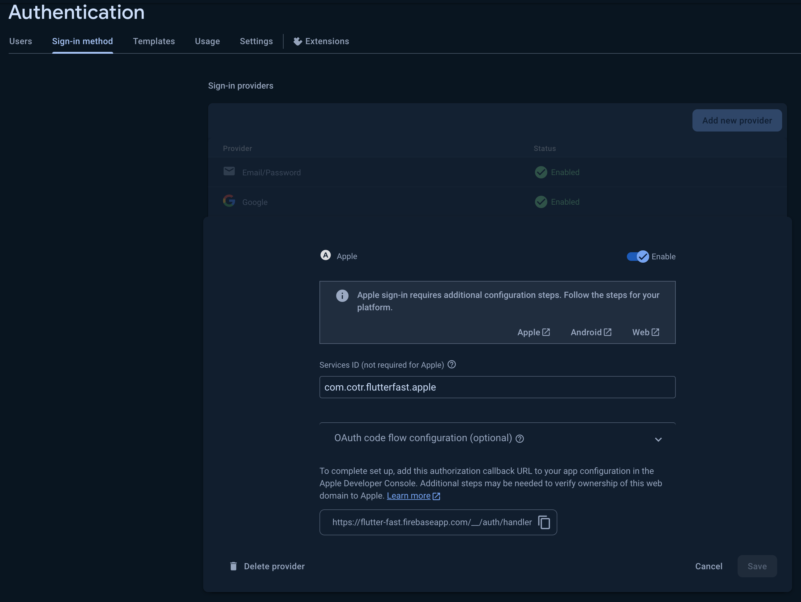
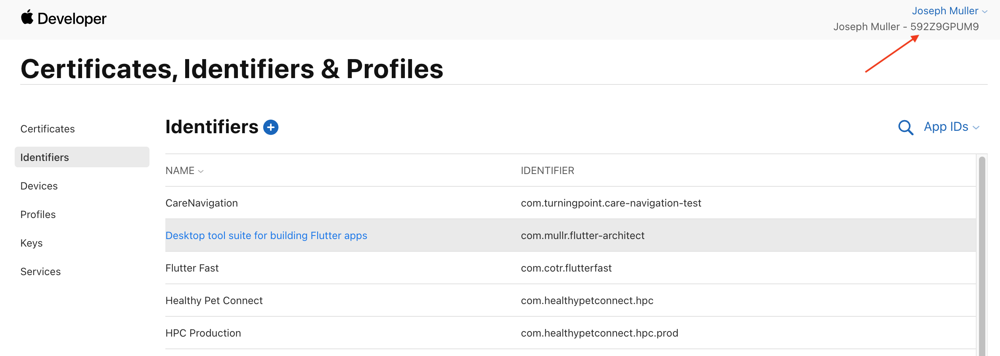
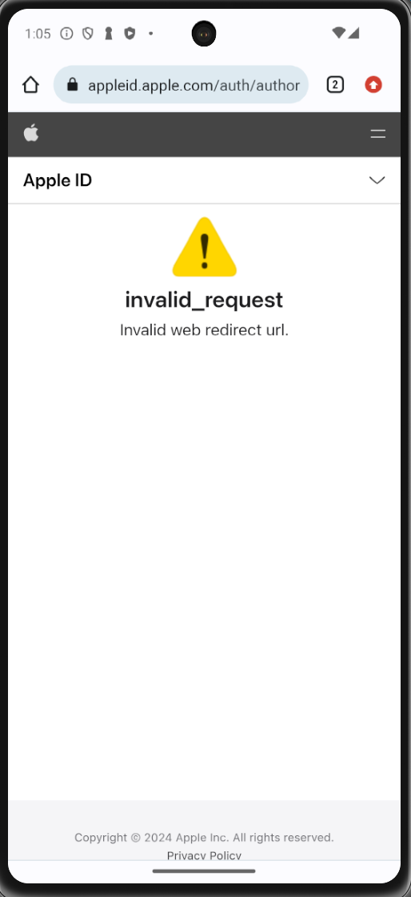
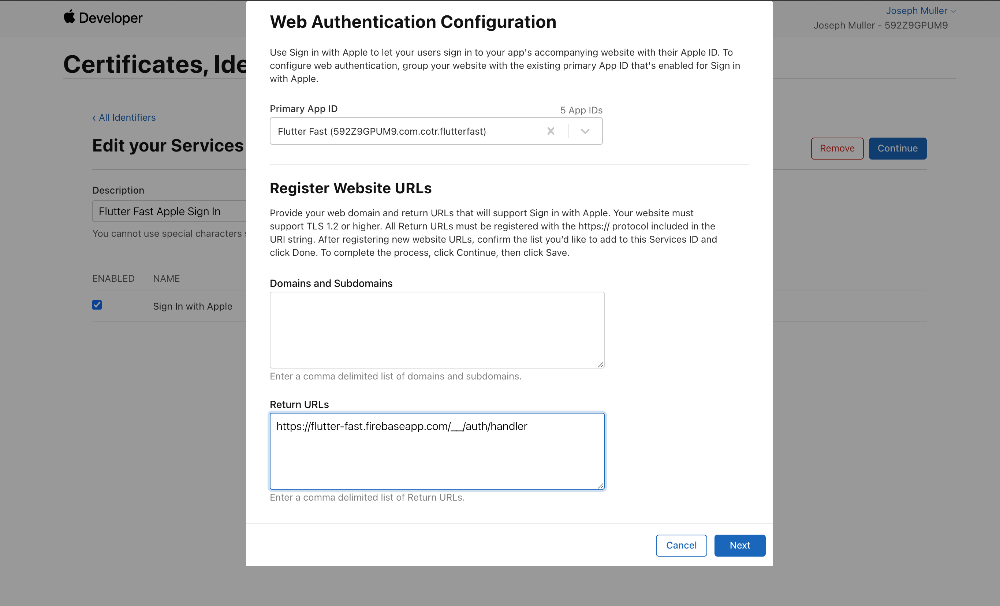

[Firebase](https://firebase.google.com/) is a platform offering authentication, data storage, file storage, analytics, crashlytics, and remote configuration for your app.

## Setup

### FoolScript

To use the Firebase app template, clone the FoolScript template repo and then merge the `firebase` branch into `main`.

### Firebase

You will need to create a new Firebase project and connect it to the Flutter app.

Once you've created the Firebase project, run the following command in the root of your app project:

```bash
flutterfire config
```
When prompted, select the Firebase project you just created.

## Authentication
:::note[Resources]
-  [Firebase Authentication](https://firebase.google.com/docs/auth/)
:::

### Email and Password

To start using email and password authentication, navigate to `Authentication` > `Sign-in method` in the Firebase console and enable the Email/Password authentication method:



### Google Sign In

Enable Google Sign In in your Firebase console and follow the [official instructions](https://firebase.google.com/docs/auth/flutter/federated-auth) to complete the setup.:



Run `flutterfire config` inside your Flutter app to setup each platform. Its important to run this after enabling Google Sign in so that the generated GoogleServices-Info files contain the correct information.

#### Android

Next, [add your machine's SHA1](https://developers.google.com/android/guides/client-auth) to your Firebase settings. To do this, you'll first need to create your release key:

```shell
keytool -genkey -v -keystore ~/Dev/keys/foolscript.jks -keyalg RSA -keysize 2048 -validity 10000 -alias upload
```

Then you can list the details of that key to find the SHA1:

```shell
keytool -list -v -alias upload  -keystore ~/Dev/keys/foolscript.jks
```

The SHA1 and SHA256 will be listed under "Certificate fingerprints". Add these to your Firebase project under Project Settings -> Your Apps -> Android App -> SHA certificate fingerprints.

You will also need to add your debug SHA1 which you can find using this command (password is "android"):

```shell
keytool -list -v -alias androiddebugkey -keystore ~/.android/debug.keystore
```

and then add the [google_sign_in](https://pub.dev/packages/google_sign_in) package and follow the instructions for setting up each platform.

#### iOS

You can find your CLIENT_ID in `ios/Runner/GoogleService-Info.plist`. If you don't see it there, you can also navigate to the project settings screen in the Firebase console, select the iOS app from the app list, and download the most up to date file.


Once you've found the client ID, add it to `Info.plist`:

```plist
<key>GIDClientID</key>
<!-- TODO Replace this value: -->
<!-- Copied from GoogleService-Info.plist key CLIENT_ID -->
<string>[YOUR IOS CLIENT ID]</string>
```

You'll also need to add the following section with your `REVERSED_CLIENT_ID`:

```
<!-- Put me in the [my_project]/ios/Runner/Info.plist file -->
<!-- Google Sign-in Section -->
<key>CFBundleURLTypes</key>
<array>
	<dict>
		<key>CFBundleTypeRole</key>
		<string>Editor</string>
		<key>CFBundleURLSchemes</key>
		<array>
			<!-- TODO Replace this value: -->
			<!-- Copied from GoogleService-Info.plist key REVERSED_CLIENT_ID -->
			<string>com.googleusercontent.apps.861823949799-vc35cprkp249096uujjn0vvnmcvjppkn</string>
		</array>
	</dict>
</array>
<!-- End of the Google Sign-in Section -->
```

#### Web

:::tip[Coming Soon]
Web support documentation will be added shortly
:::

### Apple Sign In


:::note[Resources]
- [Authenticate Using Apple (Firebase)](https://firebase.google.com/docs/auth/ios/apple)
- [Authenticate Using Apple (Flutter)](https://firebase.google.com/docs/auth/flutter/federated-auth#apple)
- [Configure Sign in with Apple for the Web](https://developer.apple.com/help/account/configure-app-capabilities/configure-sign-in-with-apple-for-the-web)
:::

In the Firebase console, enable the Apple sign in method:



If you have not already, create a new App ID in the [Apple Developer Console](https://developer.apple.com/account/resources/identifiers/list/bundleId).

Create a new Service ID in the Apple Developer Console by following these steps:

1. In [Certificates, Identifiers & Profiles](https://developer.apple.com/account/resources), click Identifiers in the sidebar, then click the add button (+) on the top left.
2. Select Services ID, then click Continue.
3. Enter the Services ID description and provide a unique identifier.
4. Register the Services ID and select it from the list to start configuration.
5. Select Sign in with Apple, then click Configure.
6. In the modal that appears, select your app from the list of primary App IDs that is related to your website.
7. Under Website URLs, provide your domains, subdomains, or return URLs as a comma-delimited list. You must provide at least one domain or subdomain.
   You can find your authorization callback URL in your Firebase console under Authentication -> Sign-in method -> Apple.
   It will look like this:
   `https://YOUR_FIREBASE_PROJECT_ID.firebaseapp.com/__/auth/handler`
   Also add the domain portion of the callback to the domains list (ex. `YOUR_FIREBASE_PROJECT_ID.firebaseapp.com`).
8. Click Done to store your configuration.
9. Click Continue.

You'll need to add the Sign In with Apple capability to your App ID:

1. On the [identifiers](https://developer.apple.com/account/resources/identifiers) page in the Apple Developer Console, select the App ID for your app
2. Scroll down to the "Sign In with Apple" capability and check the box
3. Press Save

Next, you'll need to create an [Sign in with Apple private key](https://developer.apple.com/help/account/configure-app-capabilities/create-a-sign-in-with-apple-private-key/).

1. Select the [Keys](https://developer.apple.com/account/resources/authkeys/list) tab in the Apple Developer Console and click the add button (+).
2. Under Key Name, enter a unique name for the key.
3. Select the checkbox next to the services you want to enable, then click Continue.
4. If the Media Services checkbox is disabled, you need to register a media identifier first.
   If you register more than one media identifier, click Configure next to the checkbox.
   On the next page, choose the media identifier you want to use from the pop-up menu, then click Continue.
5. Review the key configuration, then click Confirm. Optionally, click Download to generate and download the key now.
6. If you download the key, it’s saved as a text file with a .p8 file extension in the Downloads folder.
7. Click Done.

> Save this file in a secure place because the key is not saved in your developer account and you won’t be able to download it again. If the Download button is disabled, you previously downloaded the key.

Back in the Firebase console, navigate to the Apple Sign In method and fill in the "OAuth code flow configuration" section with the information from above:

**Apple team ID**

Go to the [identifiers](https://developer.apple.com/account/resources/identifiers) page and find your team ID in the upper right:


**Key ID**

Go to the Keys page and select the key you just created. The Key ID is listed at the top of the page.

**Private Key**

Right click on the `.p8` file you downloaded and open it in a text editor. Copy the entire contents of the file and paste it into the "Private Key" field in the Firebase console.

#### Android

No additional setup is required for Android.

#### iOS

Open your app in Xcode and verify that the `Sign In with Apple` capability is enabled. You can do this by opening the project settings and selecting the `Signing & Capabilities` tab.


#### Web

:::tip[Coming Soon]
Documentation will be added shortly
:::

### Troubleshooting

If you see an `invalid_request` error when trying to sign in with Apple, it's likely that the callback URL you've added to the Apple Service ID does not match the one in your Firebase console. Make sure they match exactly.



1. Navigate to the Identifiers page and select "Service IDs" from the dropdown at the upper right
2. Select your service ID
3. On the next page, select "Configure" by the Sign in with Apple section
4. Select the add (+) button next to "Website URLs"
5. Add the callback URL from your Firebase console
6. 

## Data Storage