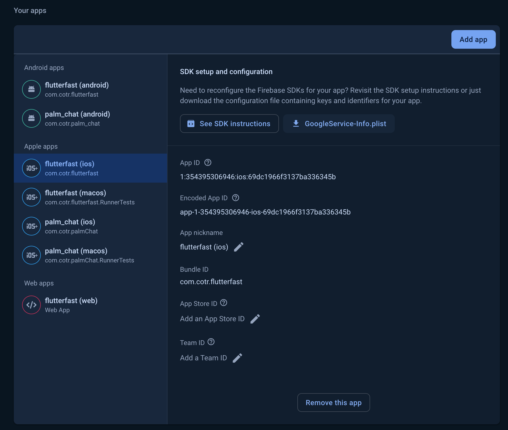

[Firebase](https://firebase.google.com/) is a platform offering authentication, data storage, file storage, analytics, crashlytics, and remote configuration for your app.

## Setup

### FoolScript

To use the Firebase app template, clone the FoolScript template repo and then merge the `firebase` branch into `main`.

### Firebase

You will need to create a new Firebase project and connect it to the Flutter app.

## Authentication
:::note
Refer to the [Firebase Authentication](https://firebase.google.com/docs/auth/) docs for more information.
:::

### Email and Password

To start using email and password authentication, navigate to `Authentication` > `Sign-in method` in the Firebase console and enable the Email/Password authentication method:

## Data Storage