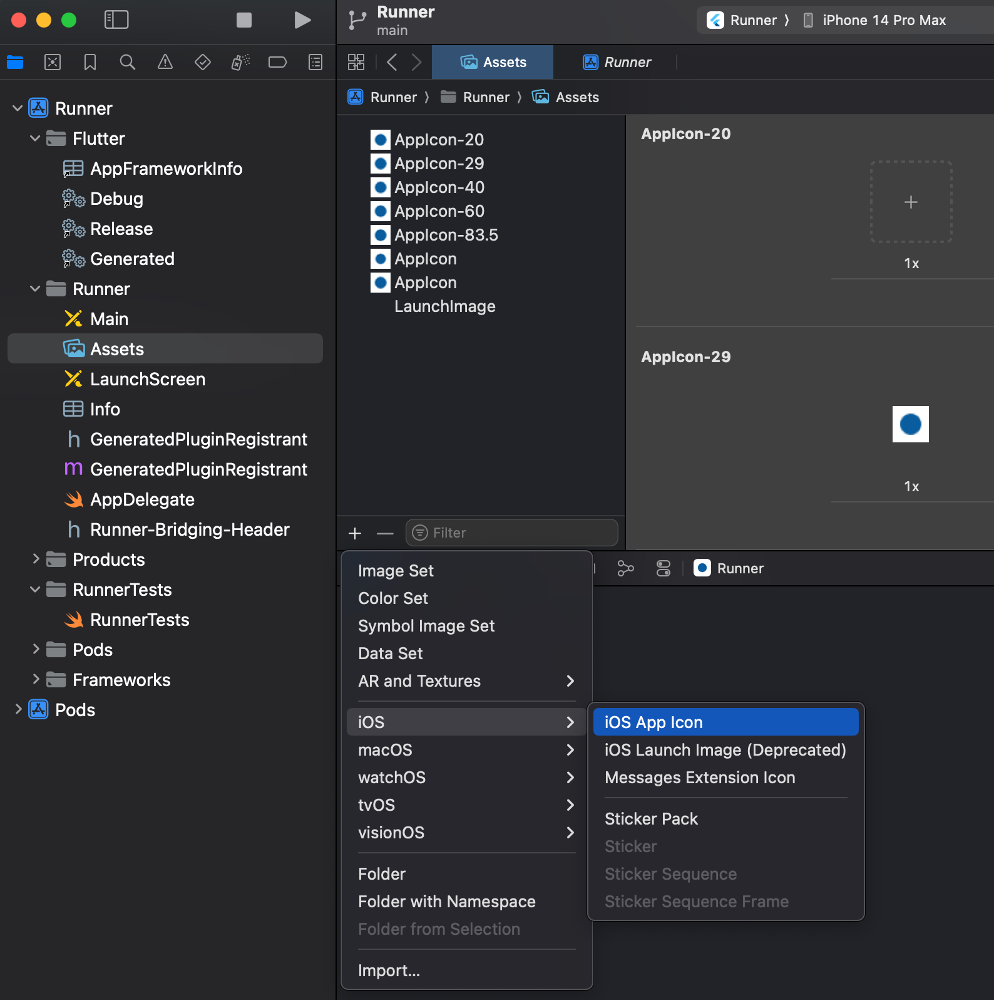
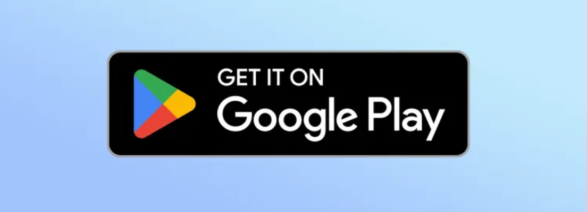

Releasing a Flutter app isn't necessarily simple. There are a hundred and one things to remember related to signing your app, creating app store assets, distributing the app, and more.

## Android

:::note
You can read more about [releasing an Android Flutter app here](https://flutter-ko.dev/deployment/android).
:::

### Build & Release

#### Sign App
```agsl
keytool -genkey -v -keystore ~path/to/key.jks -keyalg RSA -keysize 2048 -validity 10000 -alias upload
```
Then follow the steps listed [here](https://flutter-ko.dev/deployment/android#signing-the-app) to configure `app/build.gradle`.

#### Build
For the first release, use the flutter CLI. The `flutter build` command defaults to using the release build configuration. To create a release build, run the following command:
```agsl
flutter build appbundle
```

For subsequent releases, run the Fastlanes:
```agsl
cd android
fastlane internal
```

#### Fastlane

:::note
You can use a single Fastlane Key for all Google Play apps. To add a new app: 
1. Open the Google Play Console
2. Navigate to Users and Permissions
3. Select your Fastlane service account
4. Select "Add app"
5. Select your app and Save Changes 
:::

[Create a new service account](https://docs.fastlane.tools/actions/supply/#setup) for Fastlane if you don't have one already.

In the `android/fastlane/Appfile` file, update the `json_key_file` and `package_name` entries to match your project's values.

:::caution
If you don't want to send Slack notifications for new releases, delete or comment out the `send_slack_notification` functions in the android Fastfile
:::

### Assets

| Spec | Value |
| --- | --- |
| Icon Size | 512 x 512 px |
| Feature Graphic Size | 1024 x 500 px |
| Phone Screenshot Size | 9:16 Aspect Ratio |
| 7-inch Tablet Screenshot Size | 9:16 Aspect Ratio |
| 10-inch Tablet Screenshot Size | 9:16 Aspect Ratio |

#### Screenshots
> Screenshots must be PNG or JPEG, up to 8 MB each, 16:9 or 9:16 aspect ratio, with each side between 320 px and 3,840 px

You can use the [Device art generator](https://developer.android.com/distribute/marketing-tools/device-art-generator) provided by Google to create nice looking mockups.

#### Launch Icons
> Your app icon must be a PNG or JPEG, up to 1 MB, 512 px by 512 px, and meet our design specifications and metadata policy

I typically use [icon.kitchen](https://icon.kitchen/) to create my app icons. Once I've downloaded the assets, I then follow the instructions in this [Stack Overflow answer](https://stackoverflow.com/a/55054303/12806961) to add the icons to my app using Android Studio.

## iOS

:::note
You can read more about [releasing an iOS Flutter app here](https://flutter-ko.dev/deployment/ios).
:::

### Build & Release

#### Build
For the first release:
```agsl
flutter build ipa
```

For subsequent releases, run the Fastlanes:
```agsl
cd ios
fastlane beta
```

#### Fastlane

:::note
[Read more about the Appfile](https://docs.fastlane.tools/advanced/Appfile/#appfile)
:::

In the `ios/fastlane/Appfile` file, update the `app_identifier`, `apple_id`, `itc_team_id`, and `team_id` entries to match your project's values.

:::caution
If you don't want to send Slack notifications for new releases, delete or comment out the `send_slack_notification` functions in the android Fastfile
:::


### Assets 

| Spec | Value |
| --- | --- |
| Icon Size | 1024 x 1024 px |
| Feature Graphic Size | 1024 x 500 px |
| 5.5-inch Phone Screenshot Size | 1242 x 2208 px |
| 6.5-inch Phone Screenshot Size | 1284 x 2778 px |
| 12.9-inch iPad Screenshot Size | 2048 x 2732 px |

#### Screenshots

Devices for [screenshots](https://stackoverflow.com/questions/53297870/wrong-screenshot-size-in-xcode-10-using-simulator):

- 6.5 inch - iPhone 14 Pro Max
- 5.5 inch - iPhone 8 Plus
- iPad Pro (3rd gen) - iPad Pro (12.9 inch)
- iPad Pro(2nd gen) - iPad Pro (12.9 inch)

#### Launch Icons

App store icons should be [1024x1024 px](https://developer.apple.com/design/human-interface-guidelines/app-icons/#App-icon-sizes) and according to the Apple docs:

> You can let the system automatically scale down your 1024x1024 px app icon to produce all other sizes

To do this, navigate to the `Assets` section under `Runner/Runner` in XCode and press the "+" icon. Select `IOS` and then `IOS App Icon`. This will add an "AppIcon" asset to the project. You can drag a file from your finder onto one of the slots to update the launcher icon.



## Landing page

### Assets

#### Mockups
I use this [Figma file](https://www.figma.com/design/Ujf1YMU8esGvbh5ZM2CnWo/Mobile-Device-Mockups-(Community)) for creating 2D mockups. 
1. Double-click the center of a device and then select the `Image` button in the "Fill" section on the sidebar. 
2. Choose your image. 
3. Select the device frame.
4. Scroll all the way down in the sidebar to the "Export" section and export your image.

#### Badges
[Google Play Badges](https://partnermarketinghub.withgoogle.com/brands/google-play/visual-identity/badge-guidelines/?folder=65628)



[Apple App Store Badges](https://developer.apple.com/app-store/marketing/guidelines/)

