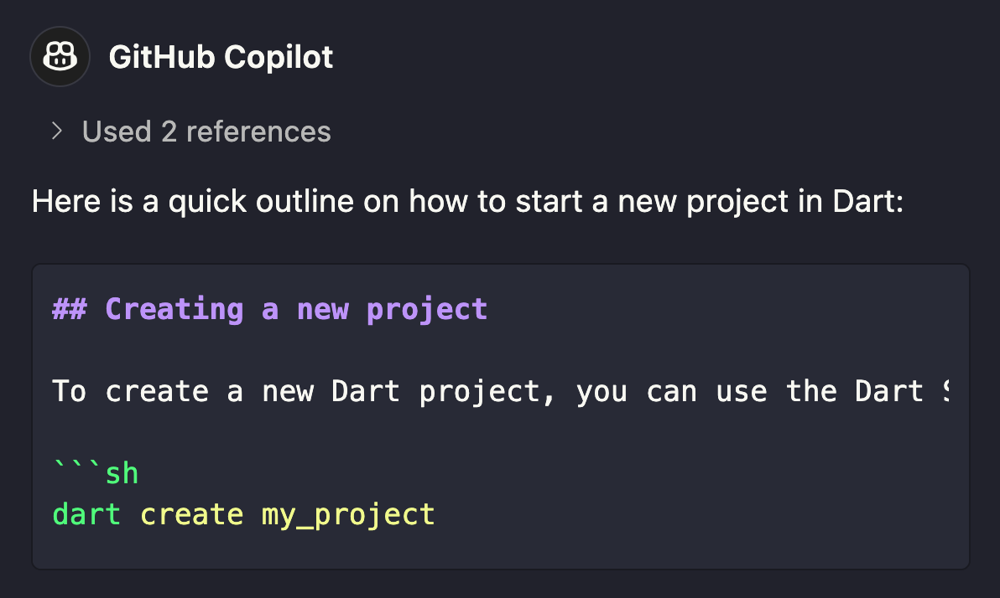
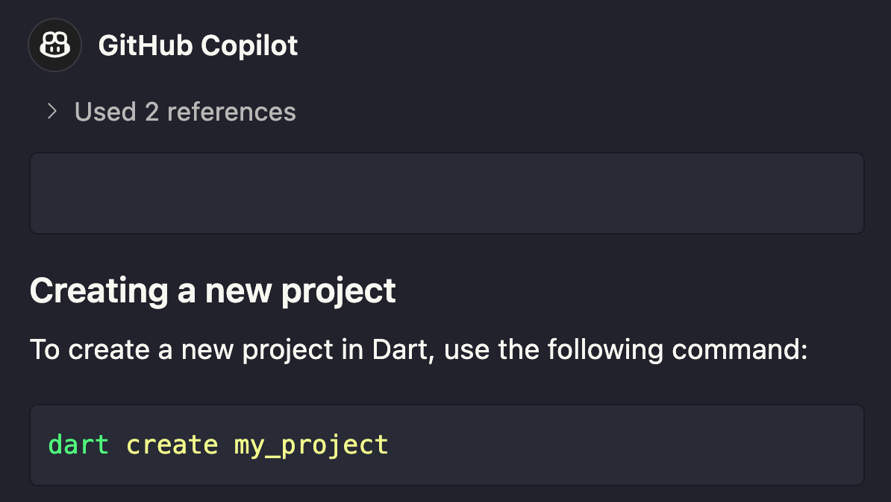

The bulk of the FoolScript system is built on top of the [new reusable prompts feature](https://code.visualstudio.com/docs/copilot/copilot-customization#_reusable-prompt-files-experimental) in VS Code. This allows you to create a `.github/prompts` folder in your project and add prompts to it. These prompts will then be available in the VS Code Copilot Chat window.

A full prompt file might look something like this (my-prompt.prompt.md):

```markdown
Create a new class called `MyClass` with the following properties:
- `name` (String)
- `age` (int)
- `isAlive` (bool)
```

## Troubleshooting

### Poor Markdown Formatting

If you want the output of your prompt to include code or formatted markdown, you need to use a small hack. At the end of your prompt, add this:

````txt
Begin your response with an empty markdown block. Add 3 backticks (```) before the response. For example:

```markdown
```
Response...
````

Without this extra instruction, Copilot will start it's markdown response with 3 backticks which will then match the opening 3 backticks of the first code block.



The proposed hack completes the first code block and starts a new one at the expense of adding an empty markdown block to the prompt output. Oh well.

