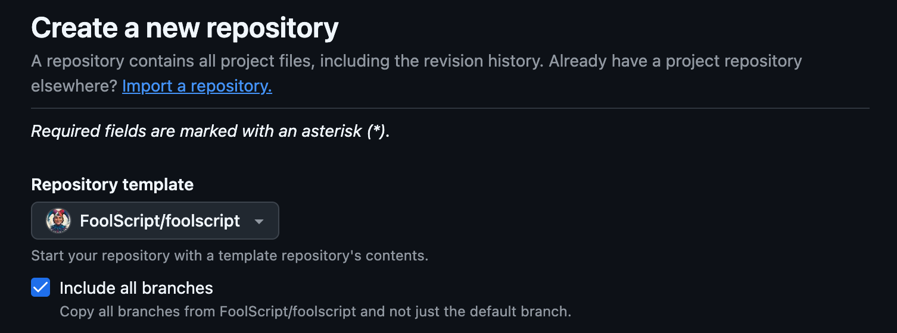

## Get Access
To access the FoolScript template repo, [sponsor me on GitHub](https://github.com/sponsors/jtmuller5)!

## Use the Template: GitHub
Once you have access, navigate to the [repo](https://github.com/FoolScript/foolscript) and press the green "Use Template" button. On the following page, make sure to check the box that says "Include all branches":



Name your new repository and then continue.

## Use the Template: CLI
Clone the [repo](https://github.com/FoolScript/foolscript):

```bash
git clone https://github.com/FoolScript/foolscript.git
```

Or use the GitHub CLI:

```bash
gh repo clone FoolScript/foolscript
```

You can also 